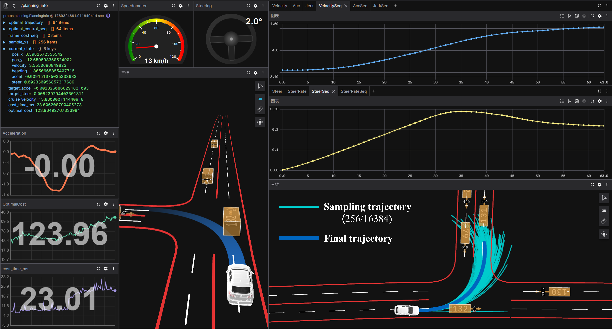

# mppi-in-autonomous-driving
Real-time probabilistic inference-based motion planning for autonomous driving with MPPI (Model Predictive Path Integral). For more information [随机轨迹优化方法入门:以MPPI为例](https://zhuanlan.zhihu.com/p/1974994324522565833)




## Build Dependencies

- **CMake** >= 3.20
- **C++17** compatible compiler
- **CUDA Toolkit** (compute capability 7.5+). You can download it from [NVIDIA CUDA Toolkit](https://developer.nvidia.com/cuda-downloads).
- **Eigen3** - Linear algebra library
- **spdlog** - Fast C++ logging library
- **yaml-cpp** - YAML parser and emitter
- **Protobuf** - Protocol buffers for data serialization

```bash
sudo apt install -y libeigen3-dev  libspdlog-dev libyaml-cpp-dev protobuf-compiler libprotobuf-dev
```

Tested on WSL2 Ubuntu 22.04🐧


## Build and Run

### 1. Clone the Repository

```bash
git clone https://github.com/your-username/mppi-in-autonomous-driving.git
cd mppi-in-autonomous-driving
```

### 2. Build

```bash
cmake -S . -B build
cmake -S . -B build -DCMAKE_BUILD_TYPE=Release \
  -DCMAKE_CUDA_COMPILER=/usr/local/cuda-12.6/bin/nvcc \
  -DFETCHCONTENT_SOURCE_DIR_COMMONROAD_CMAKE=/home/shiliu/opensource/commonroad-cmake
cmake -S . -B build -DCMAKE_BUILD_TYPE=Debug \
  -DCMAKE_CUDA_COMPILER=/usr/local/cuda-12.6/bin/nvcc \
  -DFETCHCONTENT_SOURCE_DIR_COMMONROAD_CMAKE=/home/shiliu/opensource/commonroad-cmake
cmake --build build -j$(nproc)
```

### 3. Run

After compilation, the executable file `planning_node` will be generated in the build folder. Specify a parameter configuration file for it to start the program.

```bash
./build/planning_node -c ./config/default.yaml
./build/planning_node -c ./config/lane_change.yaml
./build/planning_node -c ./config/turn_left.yaml
./build/planning_node -c ./config/turn_right.yaml
./build/planning_node -c ./config/two-into-one-merge.yaml
```


## Visualization with Foxglove

Before viewing the visualization results, you need to manually load the layout file from `assets/mppi_layout.json` and install the extension from [foxglove-gauge-extension](https://github.com/PuYuuu/foxglove-gauge-extension).

The system publishes planning and simulation data via Foxglove WebSocket.  Open Foxglove Studio and connect to `ws://localhost:8765` to online real-time visualize. Additionally, if the `save_mcap` option is set to `true` in the configuration file, the simulation data will be saved in the `log` folder for offline viewing.  For information on using Foxglove, please refer to its official documentation [Foxglove Docs](https://docs.foxglove.dev/docs).

Here are some quick demos🎬.

https://github.com/user-attachments/assets/3387b623-9bd0-4f4a-91f1-ba4cc190fcc0

https://github.com/user-attachments/assets/79b31209-a74b-48f4-a2c8-ca02983f300f

https://github.com/user-attachments/assets/f3711028-47dc-48ab-8cae-cd391bf46fe0

https://github.com/user-attachments/assets/c5f1b27f-79e4-4cad-b65f-d65db38b9e3b


## Acknowledgements

[MPPI-Generic](https://github.com/ACDSLab/MPPI-Generic) provides the C++/CUDA library for GPU-accelerated stochastic trajectory optimization, [foxglove-sdk](https://github.com/foxglove/foxglove-sdk) provides visualization and data playback, and [CommonRoad](https://github.com/CommonRoad/environment-model) for simulation interface.
